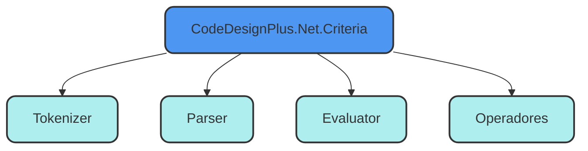

import { Aside, Steps, Tabs, TabItem, LinkCard } from '@astrojs/starlight/components';


La librería `CodeDesignPlus.Net.Criteria` proporciona una implementación del patrón Criteria en C#, que permite filtrar y ordenar colecciones de objetos de forma dinámica. A través de componentes como el `Tokenizer`, el `Parser` y el `Evaluator`, la librería convierte expresiones en formato string a expresiones lambda en C#, lo que facilita la construcción de consultas personalizadas en tiempo de ejecución.

## Propósito y Alcance
---

El propósito de `CodeDesignPlus.Net.Criteria` es proporcionar una forma flexible y reutilizable de filtrar y ordenar datos en C#. La librería está diseñada para simplificar la construcción de consultas dinámicas, permitiendo a los desarrolladores definir criterios de búsqueda de manera programática, en lugar de escribir consultas SQL o LINQ manualmente.

## Principales características
---

- **Patrón Criteria**: Implementación del patrón Criteria para construir consultas dinámicas.
- **Tokenizer**: Componente para dividir expresiones en tokens.
- **Parser**: Componente para construir el Árbol de Sintaxis Abstracta (AST).
- **Evaluator**: Componente para convertir el AST en expresiones lambda en C#.
- **Operadores**: Operadores de comparación y lógicos para definir condiciones de búsqueda.
- **Flexibilidad**: Permite construir filtros y ordenamientos personalizados en tiempo de ejecución.

## Casos de uso típicos
---

- **Filtrado Dinámico**: Construcción de consultas flexibles que se adaptan a diferentes criterios de búsqueda.
- **Ordenación Personalizada**: Definición de criterios de ordenación en función de las necesidades del usuario.
- **Consultas Complejas**: Construcción de consultas avanzadas sin la necesidad de escribir código SQL o LINQ manualmente.

## Componentes Principales
---

La librería `CodeDesignPlus.Net.Criteria` se compone de tres componentes clave: el `Tokenizer`, el `Parser`, el `Evaluator` Y los Operadores. Estos componentes trabajan en conjunto para convertir expresiones en formato string a expresiones lambda en C#, lo que permite filtrar y ordenar colecciones de objetos de forma dinámica.



### Tokenizer
El <a href="/libs/criteria/services/tokenizer">Tokenizer</a> descompone una expresión en una serie de pequeños componentes llamados tokens. Estos tokens son la representación básica de las partes individuales de una expresión. Por ejemplo, para la expresión `Name ~= "John" and Age > 30`, el tokenizer generaría tokens como `Name`, `~=`, `"John"`, `and`, `Age`, `>` y `30`.

<LinkCard title="Explora la Clase Tokenizer" href="/libs/criteria/services/tokenizer" />

### Parser

El <a href="/libs/criteria/services/parser">Parser</a> toma los tokens generados por el tokenizer y construye el Árbol de Sintaxis Abstracta (AST, por sus siglas en inglés). El AST es una representación jerárquica de la expresión, donde cada nodo del árbol corresponde a una operación o un valor dentro de la expresión.

Por ejemplo, si la expresión es `Name ~= "John" and Age > 30`, el parser crea un árbol con dos ramas principales: una que representa la operación `Name ~= "John"` y otra que representa `Age > 30`. Estas ramas se combinan con el operador `and`. El parser permite estructurar la expresión de forma lógica y jerárquica, de manera que pueda ser evaluada posteriormente.

El Parser es esencial, ya que organiza la expresión en una estructura coherente, lo que facilita la transformación del AST en una expresión lambda evaluable.

<LinkCard title="Explora la Clase Parser" href="/libs/criteria/services/parser" />

### Evaluator

El <a href="/libs/criteria/services/evaluator">Evaluator</a> se encarga de tomar el AST generado por el parser y traducirlo en una expresión lambda en C#. Esta expresión lambda es lo que finalmente se utiliza para filtrar o manipular datos en un conjunto de objetos o una base de datos. El evaluator interpreta los nodos del AST y genera las llamadas a métodos, operaciones lógicas y comparaciones que se ejecutarán en tiempo de ejecución.

Por ejemplo, la expresión `Name ~= "John"` se convierte en una expresión lambda que llama al método `Contains` de la clase `string`, y la expresión `Age > 30` se convierte en una comparación de tipo `Expression.GreaterThan`.

<LinkCard title="Explora la Clase Evaluator" href="/libs/criteria/services/evaluator" />


### Operadores

Los operadores son elementos clave en las expresiones Criteria, ya que permiten definir las condiciones de búsqueda y filtrado. Los operadores disponibles en la librería `CodeDesignPlus.Net.Criteria` incluyen operadores de comparación y operadores lógicos.

#### Operadores de Comparación

Los operadores de comparación permiten evaluar relaciones entre propiedades de un objeto y valores constantes. Algunos de los operadores de comparación disponibles son:

| Operador | Nombre               | Descripción                                                | Ejemplo de Uso                         | Resultado Esperado                                           |
|----------|----------------------|------------------------------------------------------------|----------------------------------------|-------------------------------------------------------------|
| `^=`     | Comienza con          | Verifica si una cadena empieza con un valor específico.     | `Name ^= "Order"`                      | Verdadero si el nombre de la orden comienza con "Order".     |
| `$=`     | Termina con           | Verifica si una cadena termina con un valor específico.     | `Name $= "1"`                          | Verdadero si el nombre de la orden termina en "1".           |
| `~=`     | Contiene              | Verifica si una cadena contiene un valor específico.        | `Description ~= "Description"`         | Verdadero si la descripción contiene la palabra "Description".|
| `=`      | Igual a               | Verifica si dos valores son iguales.                       | `Total = 200`                          | Verdadero si el total de la orden es igual a 200.            |
| `<`      | Menor que             | Verifica si un valor es menor que otro.                    | `Total < 300`                          | Verdadero si el total de la orden es menor que 300.          |
| `>`      | Mayor que             | Verifica si un valor es mayor que otro.                    | `Total > 100`                          | Verdadero si el total de la orden es mayor que 100.          |
| `<=`     | Menor o igual que     | Verifica si un valor es menor o igual a otro.              | `Total <= 200`                         | Verdadero si el total de la orden es menor o igual a 200.    |
| `>=`     | Mayor o igual que     | Verifica si un valor es mayor o igual a otro.              | `Total >= 90`                          | Verdadero si el total de la orden es mayor o igual a 90.     |

#### Operadores Lógicos

Los operadores lógicos permiten combinar múltiples condiciones de filtrado. Algunos de los operadores lógicos disponibles son:

| Operador | Nombre         | Descripción                                               | Ejemplo de Uso                                      | Resultado Esperado                                           |
|----------|----------------|-----------------------------------------------------------|-----------------------------------------------------|-------------------------------------------------------------|
| `and`    | Y lógico       | Verifica si ambas expresiones son verdaderas.              | `Name ^= "Order" \|and\| Total > 100`                   | Verdadero si el nombre de la orden comienza con "Order" y el total es mayor que 100. |
| `or`     | O lógico       | Verifica si al menos una de las expresiones es verdadera.  | `Name ^= "Order" \|or\| Total < 100`                    | Verdadero si el nombre de la orden comienza con "Order" o el total es menor que 100. |


## Primeros Pasos
---

En esta sección, se describen los requisitos previos y los pasos necesarios para instalar la librería `CodeDesignPlus.Net.Criteria` en tu proyecto. Además, se proporciona un ejemplo de uso para mostrar cómo filtrar y ordenar colecciones de objetos en C# utilizando el patrón Criteria.

### Requisitos previos

- .NET 8 o superior.
- Conocimientos básicos de C# y LINQ.

### Instalación

Para instalar la librería `CodeDesignPlus.Net.Criteria`, puedes añadir el paquete NuGet a tu proyecto a través de la consola de administración de paquetes de Visual Studio o mediante la CLI de .NET.

<Tabs>

    <TabItem label=".Net CLI">
    ```bash
    dotnet add package CodeDesignPlus.Net.Criteria
    ```
    </TabItem>

    <TabItem label="Nuget">
    ```bash
    Install-Package CodeDesignPlus.Net.Criteria
    ```
    </TabItem>

    <TabItem label="Package Reference">
    ```bash
    <PackageReference Include="CodeDesignPlus.Net.Criteria" Version="1.0.0" />
    ```
    </TabItem>

</Tabs>

## Ejemplo rápido
---

Este ejemplo de [`CodeDesignPlus.Net.Criteria.Sample`](https://github.com/codedesignplus/CodeDesignPlus.Net.Sdk/tree/main/examples/CodeDesignPlus.Net.Criteria.Sample) muestra cómo utilizar la clase Criteria para filtrar y ordenar colecciones de objetos en C#. La clase permite convertir expresiones en formato string a expresiones lambda que se pueden aplicar a consultas LINQ. Esto es útil cuando se necesita flexibilidad para construir filtros dinámicos y ordenar resultados en tiempo de ejecución, sin necesidad de escribir manualmente las expresiones en código.

```csharp url="examples/CodeDesignPlus.Net.Criteria.Sample/Program.cs"
```

<Steps>
1. Filtros y Ordenación:
    - Al igual que en el ejemplo anterior, aplicamos un filtro a las órdenes basándonos en la expresión string.
    - Se añade el campo `OrderBy`, que indica que la lista debe ser ordenada por el campo `Total`, y `OrderType`, que define el tipo de ordenación (descendente en este caso).

    ```csharp
    var criteria = new Criteria()
    {
        Filters = expressionAllOrders,
        OrderBy = "Total",
        OrderType = OrderTypes.Descending
    };
    ```

2. Expresiones Lambda:

    Generamos dos expresiones lambda:

    - Una para aplicar los filtros (`GetFilterExpression<Order>()`).
    - Otra para organizar los datos (`GetSortByExpression<Order>()`).

    ```csharp
    var lamda = criteria.GetFilterExpression<Order>();
    var sort = criteria.GetSortByExpression<Order>();
    ```

3. Aplicación de Filtros y Ordenación:

    Primero, aplicamos el filtro sobre la lista de órdenes. Luego, verificamos el tipo de orden (ascendente o descendente) y aplicamos la ordenación correspondiente usando `OrderBy` o `OrderByDescending`.

    ```csharp
    if (criteria.OrderType == OrderTypes.Ascending)
        orders = orders.OrderBy(sort);
    else
        orders = orders.OrderByDescending(sort);
    ```

4. Salida en Consola:
    Iteramos sobre las órdenes filtradas y ordenadas, mostrando tanto el nombre como el total de cada orden.

    ```csharp
    foreach (var order in orders)
    {
        Console.WriteLine($"Order: {order.Name}, Total: {order.Total}");
    }
    ```
</Steps>

## Métodos de extensión
---

La librería `CodeDesignPlus.Net.Criteria` proporciona una serie de métodos de extensión que facilitan la implementación del patrón Criteria en C#. Estos métodos permiten construir filtros y ordenamientos personalizados de forma sencilla y reutilizable.


### CriteriaExtensions

La clase `CriteriaExtensions` proporciona métodos de extensión que simplifican el trabajo con objetos de criterio, permitiendo la conversión de criterios a expresiones que pueden ser utilizadas en consultas LINQ. Estos métodos facilitan la creación de filtros y ordenamientos basados en criterios definidos por el usuario.

<LinkCard title="Explora la Clase CriteriaExtensions" href="/libs/criteria/extensions/criteria-extensions" />

## Conclusiones
---

La librería `CodeDesignPlus.Net.Criteria` proporciona una forma flexible y reutilizable de filtrar y ordenar colecciones de objetos en C#. A través de componentes como el `Tokenizer`, el `Parser` y el `Evaluator`, la librería convierte expresiones en formato string a expresiones lambda en C#, lo que facilita la construcción de consultas personalizadas en tiempo de ejecución. Con la implementación del patrón Criteria, los desarrolladores pueden construir filtros y ordenamientos dinámicos de forma sencilla y eficiente, sin necesidad de escribir código SQL o LINQ manualmente.

## Recursos externos
---

- [Repositorio oficial de CodeDesignPlus.Net.Criteria](https://github.com/codedesignplus/CodeDesignPlus.Net.Sdk/tree/main/packages/CodeDesignPlus.Net.Criteria)
- [Repositorio de ejemplos en GitHub](https://github.com/codedesignplus/CodeDesignPlus.Net.Sdk/tree/main/examples/CodeDesignPlus.Net.Criteria.Sample)
- [Paquete NuGet](https://www.nuget.org/packages/CodeDesignPlus.Net.Criteria)