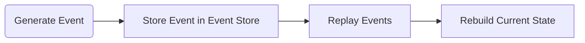

import { Tabs, TabItem, Aside, Steps, LinkCard, FileTree } from '@astrojs/starlight/components';

Event Sourcing es un patrón en el cual los cambios en el estado de la aplicación se almacenan como una secuencia de eventos. En lugar de almacenar el estado actual de una entidad, cada cambio (evento) se almacena, y el estado actual se deriva reproduciendo estos eventos. Este enfoque proporciona un registro completo de auditoría de cambios y permite una recuperación y análisis de datos más flexibles.




## Propósito y alcance
---

El propósito de `CodeDesignPlus.Net.Event.Sourcing` es proporcionar una base sólida para implementar Event Sourcing en aplicaciones .NET. La biblioteca está diseñada para simplificar la gestión de eventos de dominio y agregados, permitiendo a los desarrolladores construir sistemas escalables, auditables y flexibles. A través de abstracciones y métodos de extensión, la librería facilita la implementación de clientes como `CodeDesignPlus.Net.Event.Store` para almacenar eventos en una base de datos.

## Principales características
---

- **Interfaces y Clases Abstractas**: Proporciona interfaces y clases base para definir eventos de dominio y agregados.
- **Servicios de Event Sourcing**: Incluye servicios para interactuar con un almacén de eventos y gestionar agregados.
- **Modelos y Opciones**: Define modelos y opciones de configuración para personalizar el comportamiento de Event Sourcing.
- **Métodos de Extensión**: Proporciona métodos de extensión para configurar y utilizar los servicios de Event Sourcing.
- **Contratos y Abstracciones**: Define contratos y abstracciones para la impelementación de clientes como `CodeDesignPlus.Net.Event.Store`.

## Casos de uso típicos

- Desarrollo de sistemas basados en eventos y CQRS.
- Implementación de Event Sourcing en aplicaciones .NET.
- Gestión de eventos de dominio y agregados en sistemas distribuidos.
- Uso de Event Sourcing para auditoría y recuperación de datos.
- Arquitecturas escalables y mantenibles basadas en eventos.

## Componentes Principales---

- AggregateRoot: Clase base para los agregados raíz en el sistema de Event Sourcing.
- IEventSourcingService: Interfaz para interactuar con un almacén de eventos en un sistema de Event Sourcing.
- Metadata: Clase para almacenar metadatos de eventos de dominio.

<FileTree>
- src
    - CodeDesignPlus.Net.Event.Sourcing
        - Exceptions
            - EventSourcingException.cs
            - EventSourcingNotImplementedException.cs
        - Extensions
            - ServiceCollectionExtensions.cs
    - CodeDesignPlus.Net.Event.Sourcing.Abstractions
        - AggregateRoot.cs
        - IAggregateRoot.cs
        - IEventSourcingService.cs
        - Metadata.cs
        - Usings.cs
        - Options
            - EventSourcingOptions.cs
</FileTree>

## Primeros Pasos
---

En esta sección, aprenderás a instalar y configurar la librería `CodeDesignPlus.Net.Event.Sourcing` en tu proyecto de .NET. Además, explorarás los servicios, modelos y métodos de extensión que proporciona la librería para implementar Event Sourcing en aplicaciones .NET.

### Requisitos previos

- .NET 8 o superior.
- Conocimientos básicos de Event Sourcing y CQRS.
- Inyección de dependencias en aplicaciones .NET.

### Instalación

Para instalar la librería `CodeDesignPlus.Net.Event.Sourcing` en tu proyecto de .NET, puedes utilizar el administrador de paquetes NuGet o agregar una referencia de paquete en tu archivo `.csproj`.

<Tabs>
    <TabItem label=".Net CLI">
    ```bash
    dotnet add package CodeDesignPlus.Net.Event.Sourcing
    ```
    </TabItem>
    <TabItem label="Nuget">
    ```bash
    Install-Package CodeDesignPlus.Net.Event.Sourcing
    ```
    </TabItem>
    <TabItem label="Package Reference">
    ```bash
    <PackageReference Include="CodeDesignPlus.Net.Event.Sourcing" Version="1.0.0" />
    ```
    </TabItem>
</Tabs>

### Configuración básica

<Steps>

1. Asignar las opciones de configuración en el `appsettings.json`:

    ```json url="examples/CodeDesignPlus.Net.Event.Sourcing.Sample/src/CodeDesignPlus.Net.Event.Sourcing.Sample/appsettings.json"
    ```
2. Registra los servicios el contenedor de dependencias de tu aplicación y La implementación de `IEventSourcingService`:

    ```csharp
    // ... 
    servicesCollection.AddEventSourcing(configuration);

    servicesCollection.AddSingleton<IEventSourcingService, InMemoryEventSourcingService>();
    ```
</Steps>

## Ejemplo rápido
---

El proyecto de ejemplo [`CodeDesignPlus.Net.Event.Sourcing.Sample`](https://github.com/codedesignplus/CodeDesignPlus.Net.Sdk/tree/feature/fix-duplicate-key/examples/CodeDesignPlus.Net.Event.Sourcing.Sample) expone como hacer uso de la librería.

```csharp url="examples/CodeDesignPlus.Net.Event.Sourcing.Sample/src/CodeDesignPlus.Net.Event.Sourcing.Sample/Program.cs"
```

<Steps>

1. Configuración appsettings

    El archivo appsettings.json contiene la configuración necesaria para la librería:

    ```json
    {
        "Core": {
            "Business": "CodeDesignPlus",
            "AppName": "Net Core Sample",
            "Version": "v1",
            "Description": "Sample of CodeDesignPlus.Net.Core",
            "Contact": {
                "Name": "CodeDesignPlus",
                "Email": "custom@outlook.com"
            }
        },
        "EventSourcing": {
            "MainName": "aggregate",
            "SnapshotSuffix": "snapshot",
            "FrequencySnapshot": 20
        }
    }
    ```

2. Implementación del Aggregate

    La clase `OrderAggregate` representa un agregado raíz en el sistema de Event Sourcing. Esta clase hereda de `AggregateRoot` y define propiedades como `Name`, `IdUser` y `Products`. Además, define métodos como `Create`, `UpdateName` y `AddProduct` para modificar el estado del agregado y aplicar eventos de dominio.

    ```csharp url="examples/CodeDesignPlus.Net.Event.Sourcing.Sample/src/CodeDesignPlus.Net.Event.Sourcing.Sample/Aggregates/OrderAggregate.cs"
    ```

3. Implementación de los Eventos de Dominio

    Se definen eventos de dominio como `NameUpdatedDomainEvent`, `OrderCreatedDomainEvent` y `ProductAddedDomainEvent` que representan cambios en el estado del agregado. Estos eventos heredan de `DomainEvent` y definen propiedades como `Name`, `IdUser` y `Product` para almacenar información relevante.

    ```csharp url="examples/CodeDesignPlus.Net.Event.Sourcing.Sample/src/CodeDesignPlus.Net.Event.Sourcing.Sample/Events/NameUpdatedDomainEvent.cs"
    ```

    ```csharp url="examples/CodeDesignPlus.Net.Event.Sourcing.Sample/src/CodeDesignPlus.Net.Event.Sourcing.Sample/Events/OrderCreatedDomainEvent.cs"
    ```

    ```csharp url="examples/CodeDesignPlus.Net.Event.Sourcing.Sample/src/CodeDesignPlus.Net.Event.Sourcing.Sample/Events/ProductAddedDomainEvent.cs"
    ```

4. Implementación de `InMemoryEventSourcingService.cs` 

    Este es un ejemplo Fake para el servicio de Event Sourcing, esto se debe a `CodeDesignPlus.Net.Event.Store` tiene una implementación real para almacenar eventos en la bsae de datos Event Store.

    ```csharp url="examples/CodeDesignPlus.Net.Event.Sourcing.Sample/src/CodeDesignPlus.Net.Event.Sourcing.Sample/Services/InMemoryEventSourcingService.cs"
    ```

5. Registrar Servicios

    Se crea una colección de servicios y se agrega la configuración de event sourcing. Además, se registra `InMemoryEventSourcingService` como la implementación de `IEventSourcingService`.

    ```csharp
    var servicesCollection = new ServiceCollection();
    servicesCollection.AddEventSourcing(configuration);
    servicesCollection.AddSingleton<IEventSourcingService, InMemoryEventSourcingService>();
    ```

6. Obtención del Servicio de Event Sourcing:

    Se obtiene una instancia del servicio de event sourcing desde el proveedor de servicios.

    ```csharp
    var eventSourcing = serviceProvider.GetRequiredService<IEventSourcingService>();
    ```

7. Creación del Agregado:

    Se crea una nueva instancia de `OrderAggregate` con un identificador único, un nombre y un identificador de usuario.

    ```csharp
    var orderAggregate = OrderAggregate.Create(Guid.NewGuid(), "Order 1", Guid.NewGuid());
    ```

8. Actualización del estado del Aggregate

    Procedemos a modificar el estado del agregado para obtener los eventos y así podamos usar el proceso de rehidratación en los próximos pasos.

    ```csharp
    orderAggregate.UpdateName("Order 1 Updated");
    orderAggregate.AddProduct("Product 1");
    orderAggregate.AddProduct("Product 2");
    orderAggregate.AddProduct("Product 3");
    orderAggregate.AddProduct("Product 4");
    orderAggregate.AddProduct("Product 5");
    ```

9. Obtención y Limpieza de Eventos:

    Se obtienen y limpian los eventos generados por el agregado.

    ```csharp
    var events = orderAggregate.GetAndClearEvents();
    ```

10. Rehidratación del Agregado:

    Se rehidrata un nuevo agregado a partir de los eventos obtenidos, utilizando un nuevo identificador único.

    ```csharp
    var orderRehidrated = OrderAggregate.Rehydrate<OrderAggregate>(Guid.NewGuid(), events);
    ```
</Steps>

## Métodos de extensión
---

La librería `CodeDesignPlus.Net.Event.Sourcing` proporciona una serie de métodos de extensión para configurar y utilizar los servicios de Event Sourcing en una aplicación .NET. Estos métodos de extensión están diseñados para integrarse fácilmente con el contenedor de dependencias de .NET y simplificar la configuración de los servicios de Event Sourcing.

### ServiceCollection

ServiceCollection es una clase que proporciona métodos de extensión para registrar servicios en el contenedor de dependencias.

<LinkCard title="Explora los métodos de extensión" href="/libs/event-sourcing/extensions/service-collection" />

## Opciones de configuración
---

La biblioteca `CodeDesignPlus.Net.Event.Sourcing` proporciona opciones de configuración estructuradas y fácilmente accesibles. Estas opciones están definidas en el espacio de nombres `CodeDesignPlus.Net.Event.Sourcing.Abstractions.Options`.

<LinkCard title="Explora las opciones de configuración" href="/libs/event-sourcing/options" />

## Servicios
---

La biblioteca `CodeDesignPlus.Net.Event.Sourcing` proporciona varios servicios para interactuar con un almacén de eventos en un sistema de Event Sourcing. Estos servicios están definidos en el espacio de nombres `CodeDesignPlus.Net.Event.Sourcing.Abstractions`.

### IEventSourcingService

Esta interfaz proporciona operaciones para interactuar con un almacén de eventos. Incluye métodos para agregar eventos, cargar eventos, contar eventos y gestionar snapshots.

<LinkCard title="Explora la Clase IEventSourcingService" href="/libs/event-sourcing/services/event-sourcing" />

### AggregateRoot

Esta clase abstracta representa la clase base para los agregados raíz en el sistema de Event Sourcing. Proporciona métodos para aplicar eventos, agregar eventos y rehidratar el agregado a partir de eventos de dominios.

<LinkCard title="Explora la Clase AggregateRoot" href="/libs/event-sourcing/services/aggregate-root" />

## Models
---

La biblioteca `CodeDesignPlus.Net.Event.Sourcing` proporciona una serie de modelos que son utilizados en el sistema de Event Sourcing. Estos modelos están definidos en el espacio de nombres `CodeDesignPlus.Net.Event.Sourcing.Abstractions`.

### Metadata

Esta clase representa los metadatos del evento. Incluye propiedades como el ID del agregado, la versión, el ID del usuario y la categoría y es usada por el AggregateRoot para adicionar metadatos a los eventos.

```csharp url="packages/CodeDesignPlus.Net.Event.Sourcing/src/CodeDesignPlus.Net.Event.Sourcing.Abstractions/Metadata.cs"
```

## Conclusiones
---

En esta guía, aprendiste a instalar y configurar la librería `CodeDesignPlus.Net.Event.Sourcing` en tu proyecto de .NET. Exploraste los servicios, modelos y métodos de extensión que proporciona la librería para implementar Event Sourcing en aplicaciones .NET. Además, viste un ejemplo de uso de la librería para gestionar eventos de dominio y agregados en una aplicación .NET.

## Recursos adicionales
---

- [Repositorio oficial en GitHub](https://github.com/codedesignplus/CodeDesignPlus.Net.Sdk/tree/feature/fix-duplicate-key/packages/CodeDesignPlus.Net.Event.Sourcing)
- [Repositorio de ejemplos en GitHub](https://github.com/codedesignplus/CodeDesignPlus.Net.Sdk/tree/feature/fix-duplicate-key/examples/CodeDesignPlus.Net.Event.Sourcing.Sample)
- [Documentación de Microsoft sobre Event Sourcing](https://learn.microsoft.com/en-us/azure/architecture/patterns/event-sourcing)
- [Paquete NuGet](https://www.nuget.org/packages/CodeDesignPlus.Net.Event.Sourcing)

