import { FileTree, LinkCard } from '@astrojs/starlight/components';

El **CodeDesignPlus** es un monorepo construido con [NX](https://nx.dev/), una herramienta que permite optimizar y gestionar tareas comunes de desarrollo como compilación, pruebas, restauración de paquetes, análisis con SonarQube, y más. Esta arquitectura facilita el manejo de múltiples librerías bajo un único repositorio, promoviendo la consistencia y la eficiencia.

## Organización del Monorepo

Dentro del monorepo, encontrarás una carpeta principal llamada `packages` que contiene subcarpetas. Cada subcarpeta representa una librería del SDK. Estas librerías están diseñadas siguiendo una estructura estándar que permite mantener la claridad y facilitar su uso.

## Estructura Interna de una Librería

Cada librería en el SDK tiene la siguiente organización básica:

<FileTree>

- packages/CodeDesignPlus.Net.[LibraryName]
    - src/
        - CodeDesignPlus.Net.[LibraryName]
        - CodeDesignPlus.Net.[LibraryName].Abstractions
    - tests/
        - CodeDesignPlus.Net.[LibraryName].Test

</FileTree>


**Detalles de cada carpeta**

- **`src`**: Contiene dos proyectos principales:
  - **Abstractions**: Incluye clases, interfaces y contratos esenciales para la librería. Define el comportamiento esperado y proporciona una base para desacoplar dependencias.
  - **Implementaciones**: Proporciona las implementaciones concretas basadas en las abstracciones.

- **`tests`**: Aloja las pruebas unitarias de la librería. Estas pruebas están diseñadas para verificar el comportamiento correcto de las abstracciones y sus implementaciones, asegurando la calidad del código.
## Patrones de Diseño Recurrentes

El SDK **CodeDesignPlus.Net** utiliza patrones de diseño esenciales que ayudan a estructurar el desarrollo de microservicios de forma modular y escalable. A continuación, se describen los patrones más relevantes presentes en el SDK, ofreciendo una base sólida para desarrolladores que buscan comprender e implementar estas prácticas.

### Principios SOLID


Los principios SOLID son un conjunto de reglas que ayudan a crear software más fácil de mantener y extender. Estos principios incluyen:
- **S (Single Responsibility Principle):** Cada clase debe tener una sola responsabilidad.
- **O (Open/Closed Principle):** Las entidades de software deben estar abiertas a la extensión, pero cerradas a la modificación.
- **L (Liskov Substitution Principle):** Los objetos de una clase derivada deben poder reemplazar a los objetos de su clase base sin alterar el comportamiento del programa.
- **I (Interface Segregation Principle):** Es mejor tener muchas interfaces específicas en lugar de una interfaz genérica y amplia.
- **D (Dependency Inversion Principle):** Los módulos de alto nivel no deben depender de módulos de bajo nivel; ambos deben depender de abstracciones.

---

### Patrón de Opciones

El patrón de opciones es una práctica común en aplicaciones .NET para gestionar configuraciones de forma fuertemente tipada. Este patrón permite mapear secciones específicas de archivos de configuración (como `appsettings.json`) a clases .NET, facilitando el acceso a las opciones de configuración en el código. Las clases de opciones generalmente se registran como servicios en el contenedor de dependencias mediante `IOptions<T>`, proporcionando un mecanismo limpio y organizado para acceder a configuraciones en toda la aplicación.

### Patrón Factory


El patrón Factory es una forma de crear objetos sin especificar las clases exactas que se van a instanciar. En lugar de instanciar directamente, el cliente utiliza un método de fábrica que encapsula la lógica de creación. Esto permite cambiar las implementaciones concretas sin modificar el código del cliente.

---

### Patrón de Repositorio


El patrón de repositorio proporciona una abstracción para acceder a los datos almacenados en un backend, como una base de datos. Su objetivo es separar la lógica de negocio del acceso a datos, proporcionando una interfaz común para realizar operaciones como insertar, eliminar y consultar datos.

---

### Patrón Unidad de Trabajo (Unit of Work)


Este patrón agrupa una serie de operaciones de datos en una sola transacción. Todas las operaciones realizadas dentro de una unidad de trabajo deben completarse con éxito; de lo contrario, se revierten todas para garantizar la consistencia de los datos.

---

### Patrón de Extensiones


El patrón de extensiones permite añadir funcionalidades a clases existentes sin modificar su código original. Esto se logra mediante métodos de extensión, una característica en lenguajes como C#, que mejora la modularidad y la reutilización de código.

---

## Librerías del SDK

El CodeDesignPlus está compuesto por un conjunto de librerías diseñadas para facilitar el desarrollo de aplicaciones modulares y escalables. Cada librería en el SDK sigue una estructura coherente y estandarizada, lo que permite a los desarrolladores integrar, extender y mantener fácilmente las funcionalidades del SDK en sus proyectos. Las librerías que componen el SDK están orientadas a resolver diversos problemas comunes en el desarrollo de software, asegurando calidad, rendimiento y facilidad de uso.

A continuación, se presenta un listado de las principales librerías del CodeDesignPlus. Cada librería está diseñada para ofrecer soluciones específicas, y puedes explorar más detalles sobre cada una a través del enlace proporcionado.

### CodeDesignPlus.Net.Core

Base común para las otras librerías del SDK, con utilidades de serialización y manejo de excepciones.  

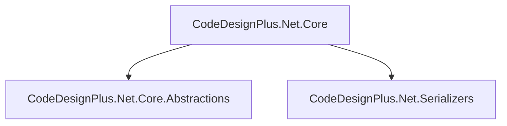

<LinkCard title="Descubre más" href="/libs/core" />

### CodeDesignPlus.Net.Criteria
Permite crear y aplicar criterios de búsqueda complejos en consultas de bases de datos.

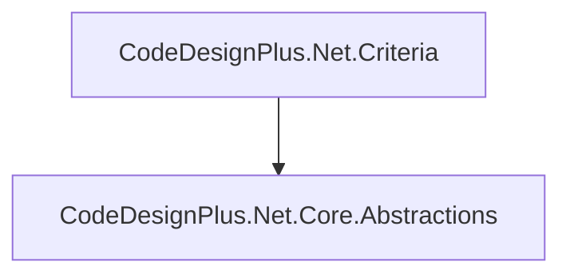

<LinkCard title="Descubre más" href="/libs/criteria" />

### CodeDesignPlus.Net.EFCore
Integración con Entity Framework Core para trabajar con bases de datos relacionales. 

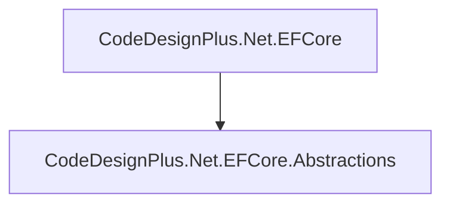

<LinkCard title="Descubre más" href="/libs/efcore" />

### CodeDesignPlus.Net.Event.Sourcing
Solución para gestionar eventos de manera persistente con Event Sourcing.  

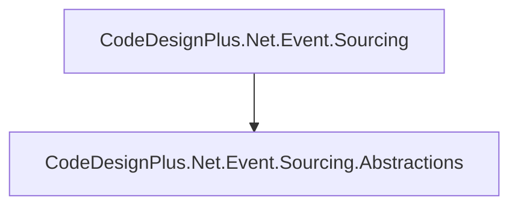

<LinkCard title="Descubre más" href="/libs/event-sourcing" />

### CodeDesignPlus.Net.EventStore
Implementación de un Event Store para almacenar eventos de manera confiable.  

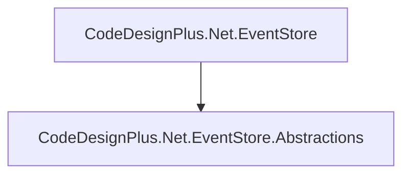

<LinkCard title="Descubre más" href="/libs/eventstore" />

### CodeDesignPlus.Net.EventStore.PubSub
Integración de Event Store con sistemas de publicación y suscripción.  

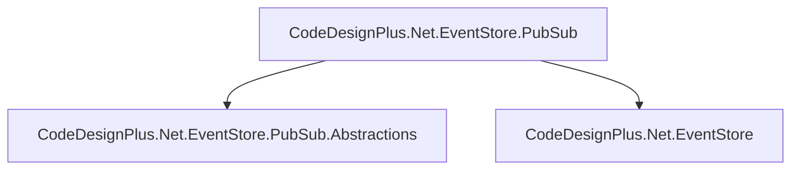

<LinkCard title="Descubre más" href="/libs/eventstore-pubsub" />

### CodeDesignPlus.Net.Exceptions
Herramientas para el manejo y gestión de excepciones en el SDK.  

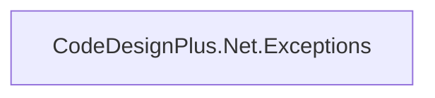

<LinkCard title="Descubre más" href="/libs/exceptions" />

### CodeDesignPlus.Net.File.Storage
Proporciona capacidades para almacenar y gestionar archivos de forma eficiente.  

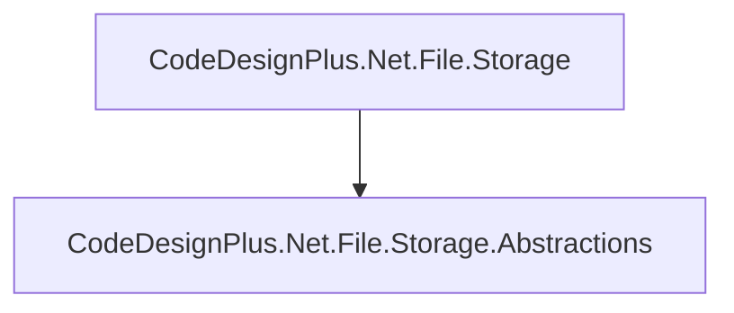

<LinkCard title="Descubre más" href="/libs/file-storage" />

### CodeDesignPlus.Net.Generator
Librería para la generación automática de códigos y configuraciones.  

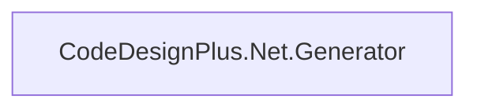

<LinkCard title="Descubre más" href="/libs/generator" />

### CodeDesignPlus.Net.Kafka
Integración con Apache Kafka para la gestión de mensajes y eventos.  

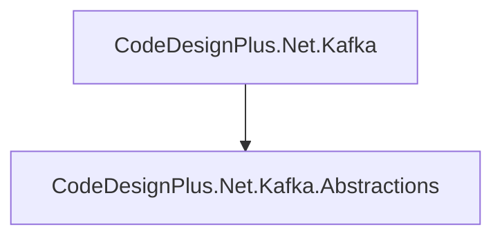

<LinkCard title="Descubre más" href="/libs/kafka" />

### CodeDesignPlus.Net.Logger
Soluciones para el registro de logs en aplicaciones .NET.  

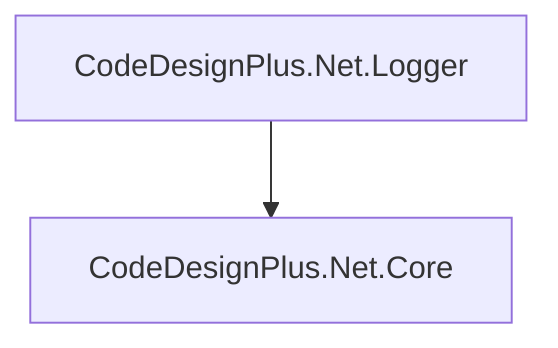

<LinkCard title="Descubre más" href="/libs/logger" />

### CodeDesignPlus.Net.Microservice.Commons
Conjunto de herramientas comunes para la arquitectura de microservicios.  

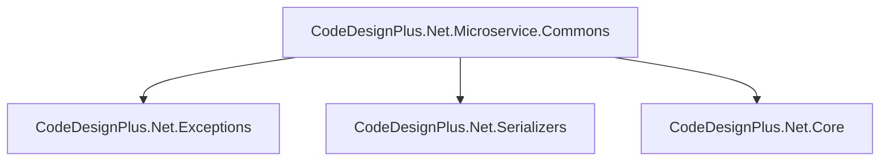

<LinkCard title="Descubre más" href="/libs/microservice-commons" />

### CodeDesignPlus.Net.Mongo
Integración con MongoDB para trabajar con bases de datos NoSQL. 

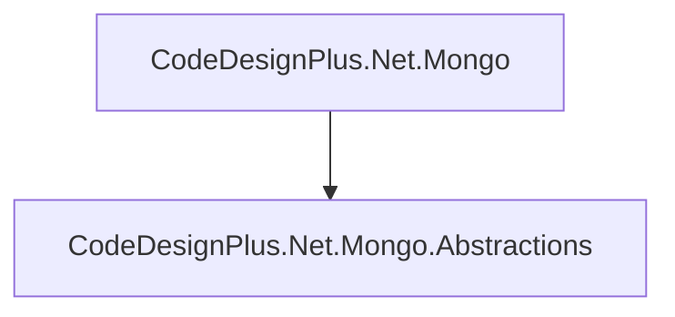
 
<LinkCard title="Descubre más" href="/libs/mongo" />

### CodeDesignPlus.Net.Mongo.Diagnostics
Herramientas para diagnosticar y monitorear aplicaciones que usan MongoDB.  

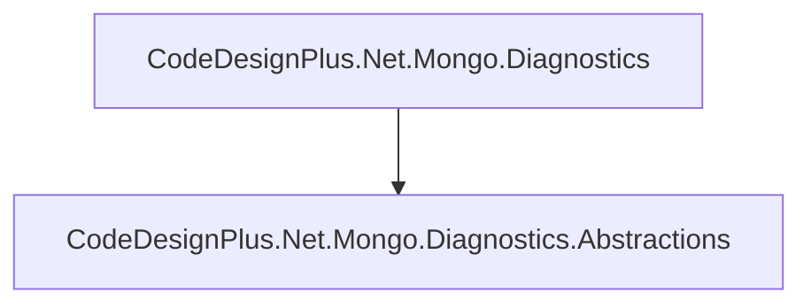

<LinkCard title="Descubre más" href="/libs/mongo-diagnostics" />

### CodeDesignPlus.Net.Observability
Soluciones para la supervisión y observabilidad de sistemas distribuidos.  

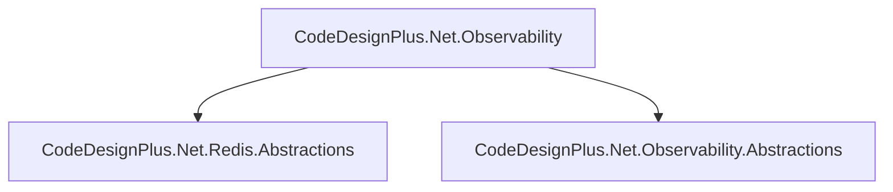

<LinkCard title="Descubre más" href="/libs/observability" />

### CodeDesignPlus.Net.PubSub
Implementación de patrones de publicación y suscripción para la comunicación entre servicios.  

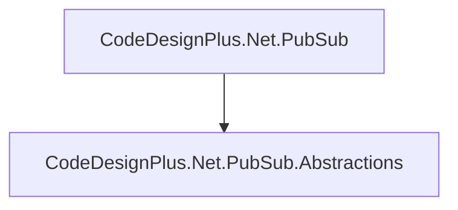

<LinkCard title="Descubre más" href="/libs/pubsub" />

### CodeDesignPlus.Net.RabbitMQ
Integración con RabbitMQ para la mensajería asíncrona.  

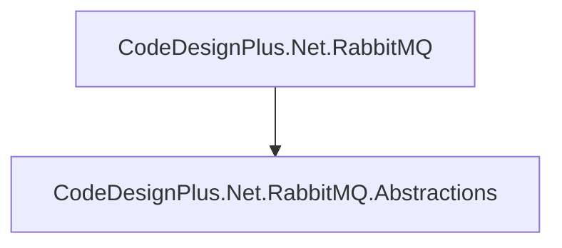

<LinkCard title="Descubre más" href="/libs/rabbitmq" />

### CodeDesignPlus.Net.Redis
Soluciones para trabajar con Redis, incluyendo almacenamiento en caché y bases de datos en memoria.  


<LinkCard title="Descubre más" href="/libs/redis" />

### CodeDesignPlus.Net.Redis.PubSub
Integración de Redis con patrones de publicación y suscripción.  

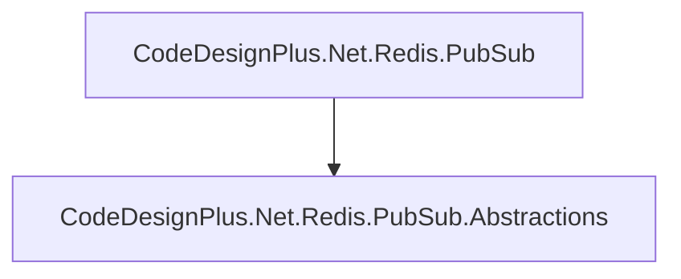

<LinkCard title="Descubre más" href="/libs/redis-pubsub" />

### CodeDesignPlus.Net.Security
Herramientas de seguridad, como cifrado y manejo de claves.  

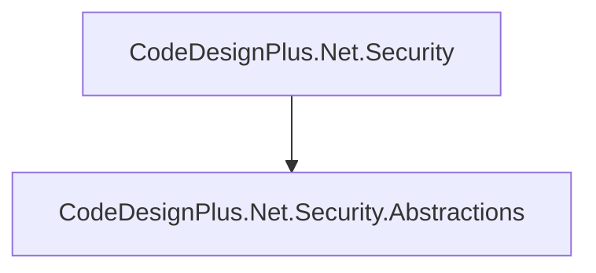

<LinkCard title="Descubre más" href="/libs/security" />

### CodeDesignPlus.Net.Serializers
Librería para la serialización y deserialización de datos en formatos como JSON.  

```mermaid
graph TD
    A[CodeDesignPlus.Net.Serializers] --> B[CodeDesignPlus.Net.Core.Abstractions]

```

<LinkCard title="Descubre más" href="/libs/serializers" />

### CodeDesignPlus.Net.Vault
Soluciones para la gestión segura de secretos y configuraciones.  

```mermaid
graph TD
    A[CodeDesignPlus.Net.xUnit] --> B[CodeDesignPlus.Net.Redis]

```

<LinkCard title="Descubre más" href="/libs/vault" />

### CodeDesignPlus.Net.xUnit
Integración con xUnit para realizar pruebas unitarias en aplicaciones .NET.  

```mermaid
graph TD
    A[CodeDesignPlus.Net.xUnit] --> B[CodeDesignPlus.Net.Redis]

```

<LinkCard title="Descubre más" href="/libs/xunit" />

### CodeDesignPlus.Net.xUnit.Microservice
Extensiones para realizar pruebas unitarias en arquitecturas de microservicios.  

```mermaid
graph TD
    A[CodeDesignPlus.Net.xUnit.Microservice]

```

<LinkCard title="Descubre más" href="/libs/xunit-microservice" />