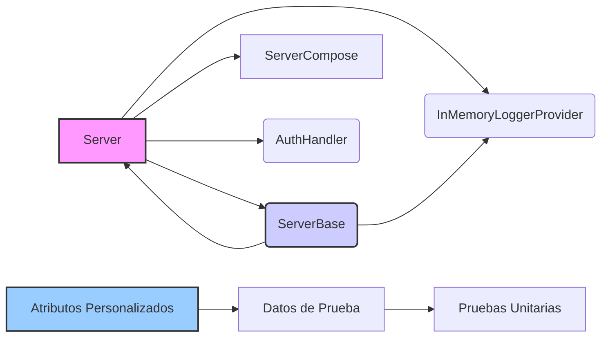

import { LinkCard, Steps, Aside, FileTree, Tabs, TabItem } from '@astrojs/starlight/components';

La librería **CodeDesignPlus.Net.xUnit.Microservice** proporciona un conjunto de clases y atributos diseñados para simplificar y estandarizar las pruebas unitarias de microservicios en .NET. Facilita la creación de entornos de pruebas controlados, la gestión de dependencias externas y la generación de datos de prueba, lo que permite a los desarrolladores validar el comportamiento de sus microservicios de manera eficiente y confiable.

## Propósito y alcance
---

El objetivo principal de esta librería es proporcionar una base sólida para las pruebas de integración y unitarias de microservicios, especialmente aquellos que utilizan patrones de diseño como agregados, eventos de dominio, entidades y DTOs.  Permite a los desarrolladores probar su lógica de negocio en un entorno aislado, facilitando la detección temprana de errores y mejorando la calidad del software.

## Principales características
---

* **Entorno de prueba configurado:**  Crea un entorno de prueba basado en `WebApplicationFactory` con opciones de configuración personalizables.
* **Gestión de dependencias:** Permite la gestión de dependencias externas como Redis, RabbitMQ, MongoDB y OpenTelemetry a través de Docker Compose.
* **Autenticación de prueba:** Incluye un `AuthHandler` para simular un usuario autenticado en las pruebas.
* **Registro en memoria:** Implementa un `InMemoryLogger` para capturar y analizar los mensajes de registro durante las pruebas.
* **Atributos de prueba:** Define atributos personalizados para facilitar la generación de datos de prueba para agregados, eventos de dominio, etc.

## Casos de uso típicos
---

* **Pruebas de integración de microservicios:** Validar el comportamiento de las APIs y la interacción con dependencias externas.
* **Pruebas unitarias de lógica de negocio:**  Probar la funcionalidad de agregados, eventos de dominio y otros componentes del modelo de dominio.
* **Pruebas basadas en datos:** Generar datos de prueba dinámicamente a partir de atributos personalizados.
* **Validación de registro:** Inspeccionar los mensajes de registro generados durante la ejecución de pruebas.

## Componentes Principales
---

- **`Server<TProgram>`:** Clase que extiende `WebApplicationFactory` para crear un entorno de prueba de un microservicio.
- **`ServerBase<TProgram>`:** Clase base para pruebas que facilita la interacción con el servidor creado por `Server<TProgram>`.
- **`ServerCompose`:**  Clase para gestionar las dependencias externas utilizando Docker Compose.
- **`AuthHandler`:**  Handler de autenticación de prueba que simula un usuario autenticado.
- **`InMemoryLoggerProvider`, `InMemoryLoggerFactory`, `InMemoryLogger`:** Componentes para capturar y gestionar los logs en memoria.
- **Atributos Personalizados:**
    -  `AggregateAttribute<TAssemblyScan>`:  Provee datos de prueba para agregados.
    -  `DomainEventAttribute<TAssemblyScan>`: Provee datos de prueba para eventos de dominio.
    -  `CommandAttribute<TAssemblyScan>`: Provee datos de prueba para comandos.
    -  `QueryAttribute<TAssemblyScan>`: Provee datos de prueba para consultas.
    -  `EntityAttribute<TAssemblyScan>`: Provee datos de prueba para entidades.
    -  `DataTransferObjectAttribute<TAssemblyScan>`: Provee datos de prueba para DTOs.
    -  `ErrorsAttribute<TAssemblyScan>`: Provee datos de prueba para errores.
    -  `StartupAttribute<TAssemblyScan>`: Provee datos de prueba para la inicialización.



<FileTree>
- src 
       - CodeDesignPlus.Net.xUnit.Microservice
              - Attributes
                     - AggregateAttribute.cs
                     - CommandAttribute.cs
                     - DataTransferObjectAttribute.cs
                     - DomainEventAttribute.cs
                     - EntityAttribute.cs
                     - ErrorsAttribute.cs
                     - QueryAttribute.cs
                     - StartupAttribute.cs
              - Server
                     - Server.cs
                     - ServerBase.cs
                     - Authentication
                            - AuthHandler.cs
                     - Logger
                            - InMemoryLogger.cs
                            - InMemoryLoggerFactory.cs
                            - InMemoryLoggerProvider.cs
                     - Services
                           - collector-config.yml
                           - docker-compose.yml
                           - DockerCompose.cs
                           - ServerCompose.cs
              - Utils
                     - Logger
                            - LoggerExtensions.cs
                     - Reflection
                            - TypeExtensions.cs
</FileTree>

## Primeros Pasos
---

En esta sección, aprenderás a instalar y configurar la librería `CodeDesignPlus.Net.xUnit.Microservice` en tu proyecto de .NET. Además, explorarás cómo utilizar sus principales componentes para configurar pruebas unitarias y de integración para tus microservicios.

### Requisitos previos

- .NET 8 o superior.
-  Un proyecto de microservicio basado en ASP.NET Core.
-  Docker Desktop instalado para la gestión de dependencias externas.
-  Una herramienta de pruebas unitarias como xUnit.

### Instalación

Para instalar la librería `CodeDesignPlus.Net.xUnit.Microservice`, puedes utilizar el administrador de paquetes NuGet o la CLI de .NET. A continuación, se muestra un ejemplo de cómo instalar la librería utilizando la CLI de .NET:

<Tabs>
    <TabItem label=".Net CLI">
    ```bash
    dotnet add package CodeDesignPlus.Net.xUnit.Microservice
    ```
    </TabItem>
    <TabItem label="Nuget">
    ```bash
    Install-Package CodeDesignPlus.Net.xUnit.Microservice
    ```
    </TabItem>
    <TabItem label="Package Reference">
    ```bash
    <PackageReference Include="CodeDesignPlus.Net.xUnit.Microservice" Version="1.0.0" />
    ```
    </TabItem>
</Tabs>

## Ejemplo rápido
---

Este ejemplo muestra cómo usar `Server` y `ServerBase` para una prueba unitaria básica:

```csharp
using CodeDesignPlus.Net.xUnit.Microservice.Server;

namespace CodeDesignPlus.Net.xUnit.Microservice.Test.Server;

public class ServerTest(Server<Program> server) : ServerBase<Program>(server), IClassFixture<Server<Program>>
{
    [Fact]
    public async Task GetWeatherForecast_ReturnsWeatherForecast()
    {
        //Act
        var response = await Client.GetAsync("/weatherforecast");

        // Assert
        response.EnsureSuccessStatusCode();
        var responseString = await response.Content.ReadAsStringAsync();

        var data = Serializers.JsonSerializer.Deserialize<IEnumerable<Api.WeatherForecast>>(responseString);

        Assert.NotNull(data);
        Assert.NotEmpty(data);
    }
}
```

## Servicios
---

La librería `CodeDesignPlus.Net.xUnit.Microservice` proporciona los siguientes servicios y componentes principales:

### AuthHandler

El `AuthHandler` es un `AuthenticationHandler` que simula la autenticación de un usuario en las pruebas. Permite a los desarrolladores probar la lógica de autorización y autenticación de sus microservicios en un entorno controlado.

<LinkCard title="Explora la clase AuthHandler" href="/libs/xunit-microservice/server/auth-handler" />

### InMemoryLoggerProvider

El `InMemoryLoggerProvider` es un proveedor de registro en memoria que captura y almacena los mensajes de registro generados durante las pruebas. Permite a los desarrolladores inspeccionar y analizar los mensajes de registro para validar el comportamiento de sus microservicios.

<LinkCard title="Explora la clase AuthHandler" href="/libs/xunit-microservice/server/inmemory-logger" />

### InMemoryLoggerFactory

El `InMemoryLoggerFactory` implementa una factoría de `ILogger` que crea instancias de `InMemoryLogger`. Proporciona una interfaz común para la creación y gestión de instancias de `ILogger` en las pruebas.

<LinkCard title="Explora la clase AuthHandler" href="/libs/xunit-microservice/server/inmemory-logger" />

## Atributos Personalizados

La librería `CodeDesignPlus.Net.xUnit.Microservice` define una serie de atributos personalizados para facilitar la generación de datos de prueba para agregados, eventos de dominio, entidades, DTOs y otros componentes del modelo de dominio. Estos atributos permiten a los desarrolladores definir datos de prueba de forma declarativa y reutilizable.

### AggregateAttribute

El `AggregateAttribute` permite a los desarrolladores definir datos de prueba para agregados en las pruebas unitarias. Proporciona una forma sencilla de generar datos de prueba para los agregados de un microservicio.

<LinkCard title="Explora la clase AggregateAttribute" href="/libs/xunit-microservice/attributes/aggregate" />

### DomainEventAttribute

El `DomainEventAttribute` permite a los desarrolladores definir datos de prueba para eventos de dominio en las pruebas unitarias. Proporciona una forma sencilla de generar datos de prueba para los eventos de dominio de un microservicio.

<LinkCard title="Explora la clase DomainEventAttribute" href="/libs/xunit-microservice/attributes/domain-event" />

### CommandAttribute

El `CommandAttribute` permite a los desarrolladores definir datos de prueba para comandos en las pruebas unitarias. Proporciona una forma sencilla de generar datos de prueba para los comandos de un microservicio.

<LinkCard title="Explora la clase CommandAttribute" href="/libs/xunit-microservice/attributes/command" />

### QueryAttribute

El `QueryAttribute` permite a los desarrolladores definir datos de prueba para consultas en las pruebas unitarias. Proporciona una forma sencilla de generar datos de prueba para las consultas de un microservicio.

<LinkCard title="Explora la clase QueryAttribute" href="/libs/xunit-microservice/attributes/query" />

### EntityAttribute

El `EntityAttribute` permite a los desarrolladores definir datos de prueba para entidades en las pruebas unitarias. Proporciona una forma sencilla de generar datos de prueba para las entidades de un microservicio.

<LinkCard title="Explora la clase EntityAttribute" href="/libs/xunit-microservice/attributes/entity" />

### DataTransferObjectAttribute

El `DataTransferObjectAttribute` permite a los desarrolladores definir datos de prueba para DTOs en las pruebas unitarias. Proporciona una forma sencilla de generar datos de prueba para los DTOs de un microservicio.

<LinkCard title="Explora la clase DataTransferObjectAttribute" href="/libs/xunit-microservice/attributes/dto" />

### ErrorsAttribute

El `ErrorsAttribute` permite a los desarrolladores definir datos de prueba para errores en las pruebas unitarias. Proporciona una forma sencilla de generar datos de prueba para los errores de un microservicio.

<LinkCard title="Explora la clase ErrorsAttribute" href="/libs/xunit-microservice/attributes/errors" />

### StartupAttribute

El `StartupAttribute` permite a los desarrolladores definir datos de prueba para la inicialización en las pruebas unitarias. Proporciona una forma sencilla de generar datos de prueba para la inicialización de un microservicio.

<LinkCard title="Explora la clase StartupAttribute" href="/libs/xunit-microservice/attributes/startup" />

## Conclusiones
---

La librería `CodeDesignPlus.Net.xUnit.Microservice` simplifica la creación de entornos de pruebas unitarias y de integración para microservicios basados en .NET.  Al proporcionar una base sólida para la gestión de dependencias, la generación de datos de prueba y el registro de información, la librería ayuda a los desarrolladores a crear software de alta calidad y confiabilidad.

## Recursos externos
---

-   [Documentación de xUnit](https://xunit.net/)
-   [Documentación de ASP.NET Core Test](https://learn.microsoft.com/en-us/aspnet/core/test/integration-tests?view=aspnetcore-8.0)
-   [Documentación de Docker Compose](https://docs.docker.com/compose/)