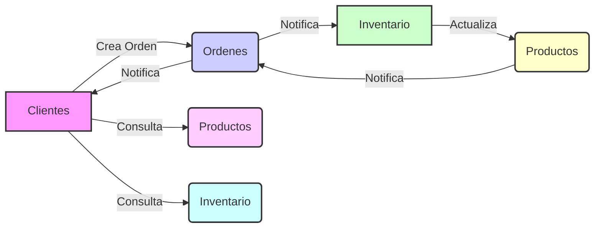
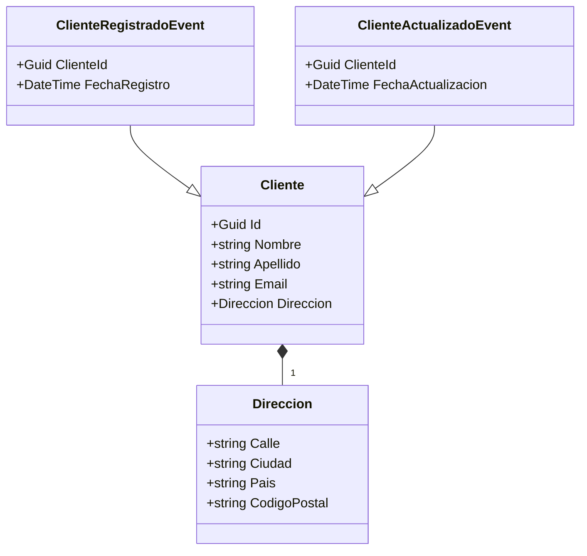
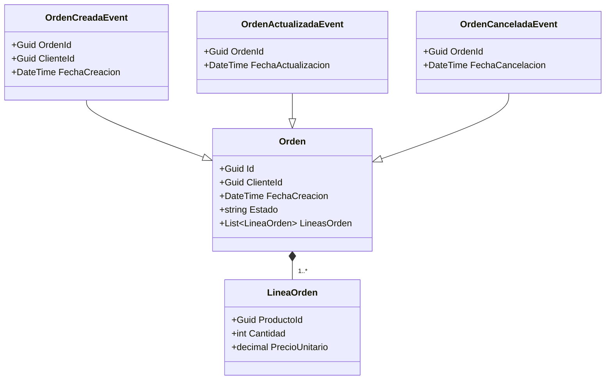
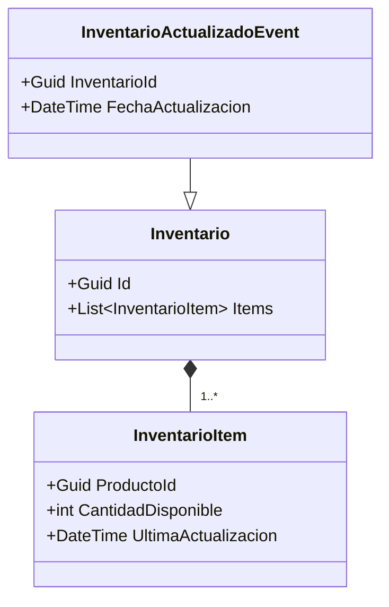
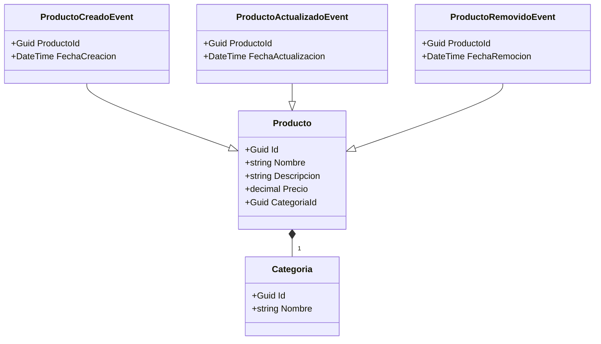

¡Excelente idea! Un ejemplo contextualizado hará que el artículo 3 sea mucho más comprensible y práctico. Vamos a definir el escenario de la tienda online, los microservicios, sus casos de uso, agregados, entidades, eventos de dominio y consumers, todo esto con el propósito de que el ejemplo sea claro y consistente.

**Diagrama del Sistema (Conceptual):**

**Descripción del Sistema:**

Nuestra tienda online está compuesta por los siguientes microservicios:

1.  **Clientes (Clientes):** Gestiona la información de los clientes.
2.  **Ordenes (Ordenes):** Gestiona el proceso de creación, modificación y seguimiento de las órdenes.
3.  **Inventario (Inventario):** Gestiona el inventario de productos, incluyendo stock disponible.
4.  **Productos (Productos):** Gestiona la información general de los productos.

**Microservicios, Casos de Uso, Agregados, Entidades, Eventos y Consumers:**

| Microservicio | Casos de Uso                                                                                                    | Agregados | Entidades          | Eventos de Dominio (Emite)                                | Consumers (Escucha)             |
| :------------ | :------------------------------------------------------------------------------------------------------------- | :-------- | :----------------- | :---------------------------------------------------------- | :------------------------------ |
| **Clientes**  | Registrar un cliente, actualizar datos del cliente, consultar datos del cliente                                    | Cliente  | Cliente, Direccion  |  ClienteRegistrado , ClienteActualizado|  OrdenCreada                                |
| **Ordenes**   | Crear una orden, actualizar una orden, cancelar una orden, consultar el estado de una orden.           | Orden     | Orden, LineaOrden     |  OrdenCreada, OrdenActualizada, OrdenCancelada           |  ProductoActualizado                               |
| **Inventario**| Actualizar el inventario, consultar la disponibilidad de productos.                                                                            | Inventario | InventarioItem          |  InventarioActualizado   | OrdenCreada                               |
| **Productos** | Agregar un producto, actualizar un producto, consultar información de un producto.                         | Producto  | Producto, Categoria     | ProductoCreado, ProductoActualizado , ProductoRemovido|  InventarioActualizado                          |

**Detalles Adicionales:**

*   **Comunicación por Eventos:** Los microservicios se comunican principalmente mediante eventos. Por ejemplo, cuando se crea una orden, el microservicio de **Ordenes** emite un evento `OrdenCreada`. El microservicio de **Inventario** escucha este evento y actualiza su stock. El microservicio **Clientes** tambien escucha este evento para hacer el respectivo envio de un correo de bienvenida al cliente.
*   **Queries y Commands:** Cada microservicio tendrá sus propios comandos y queries para manejar la lógica interna y las consultas de información, lo cual no se detalla en la tabla.
*   **Entidades:** Las entidades representan los objetos del dominio y tienen una identidad única.
*   **Agregados:** Son colecciones de entidades que se tratan como una unidad consistente.

**Contexto del Ejemplo:**

Con este contexto, los desarrolladores entenderán mejor cómo se relacionan los microservicios y cómo la arquitectura orientada a eventos permite una comunicación eficiente y un desacoplamiento entre ellos. En el artículo 3, crearemos un microservicio de ejemplo (por ejemplo, el de **Ordenes**) utilizando los generadores de CodeDesignPlus y entenderemos cómo se configura la comunicación por eventos.

**Modificación del Artículo 3:**

Con este contexto, modificaremos el artículo 3 para:

1.  Introducir el escenario de la tienda online y los microservicios.
2.  Explicar los diagramas y la relación entre los servicios.
3.  Utilizar el ejemplo del microservicio de **Ordenes** para demostrar cómo generar un microservicio Custom.

**Próximos Pasos:**

Con esta definición clara del ejemplo, ahora podemos refinar el artículo 3 para que sea más comprensible y práctico. ¿Estás de acuerdo con este enfoque? Si es así, puedo generar el artículo 3 modificado con este contexto.

-------------

¡Perfecto! Aquí tienes los diagramas de clases de las entidades, agregados y eventos de dominio para cada microservicio, utilizando una notación UML simplificada para mayor claridad:

**Microservicio Clientes**

*   **Cliente:** Agregado principal del microservicio de Clientes.
*   **Dirección:** Objeto de valor asociado al Cliente.
*  **ClienteRegistradoEvent:** Evento de dominio que se emite cuando se registra un cliente.
*  **ClienteActualizadoEvent:** Evento de dominio que se emite cuando se actualiza un cliente.

**Microservicio Ordenes**

*   **Orden:** Agregado principal del microservicio de Órdenes.
*   **LineaOrden:** Entidad que representa un ítem en la orden.
*   **OrdenCreadaEvent:** Evento de dominio que se emite cuando se crea una orden.
*   **OrdenActualizadaEvent:** Evento de dominio que se emite cuando se actualiza una orden.
*  **OrdenCanceladaEvent:** Evento de dominio que se emite cuando se cancela una orden.

**Microservicio Inventario**

*   **Inventario:** Agregado principal del microservicio de Inventario.
*   **InventarioItem:** Entidad que representa un ítem en el inventario.
*   **InventarioActualizadoEvent:** Evento de dominio que se emite cuando se actualiza el inventario.

**Microservicio Productos**

*   **Producto:** Agregado principal del microservicio de Productos.
*   **Categoria:** Entidad asociada a cada Producto.
*   **ProductoCreadoEvent:** Evento de dominio que se emite cuando se crea un producto.
*   **ProductoActualizadoEvent:** Evento de dominio que se emite cuando se actualiza un producto.
*   **ProductoRemovidoEvent:** Evento de dominio que se emite cuando se remueve un producto.

**Notas:**

*   He utilizado una notación UML simplificada para que los diagramas sean claros y fáciles de entender.
*   Cada clase incluye sus propiedades principales.
*   Las relaciones entre clases están indicadas (ej: agregación).
*   Los diagramas también muestran las relaciones de los eventos con sus respectivos agregados.

Con estos diagramas, la estructura de los microservicios y su relación se vuelve más clara y precisa. ¿Quieres que ahora prepare el **Artículo 3** modificado con toda esta información?

